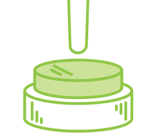

# EasyButton

[](https://gitter.im/thingsboard/chat?utm_source=badge&utm_medium=badge&utm_campaign=pr-badge&utm_content=badge)
[](https://travis-ci.org/thingsboard/thingsboard)
[](http://doge.mit-license.org)

Arduino library to debounce buttons, detect presses, releases, long presses and sequences



## How to install

- Use Arduino Library Manager
- Clone this repository into your libraries directory
- Use it locally cloning this repository into your project's directory

## How to use

###### Include the library 

``` c++
include <EasyButton.h>
```

###### Create an instance of the button

You must create an instance of EasyButton class for each button that you want to use. The constructor takes the pin number as argument.

```c++
EasyButton button(BUTTON_PIN);
```


> ###### Still working on this documentation

